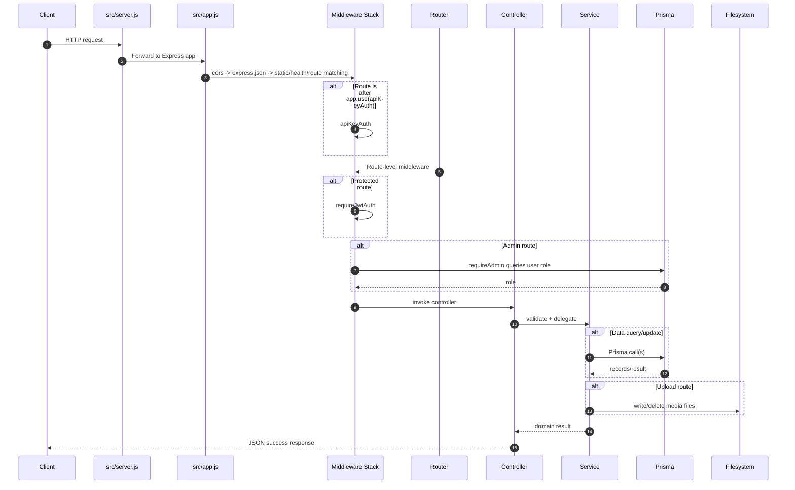
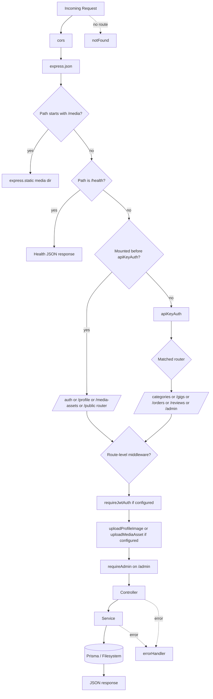
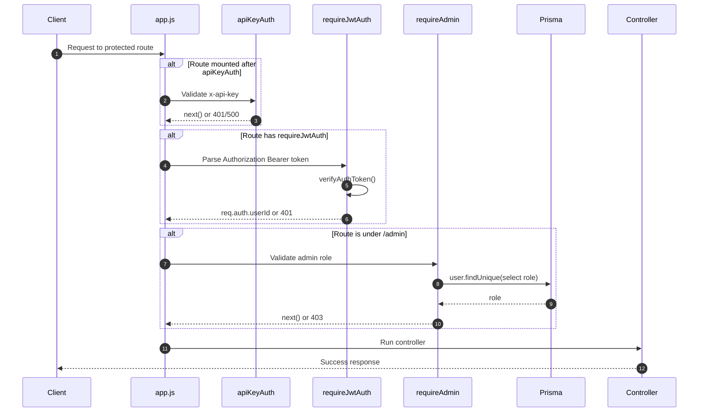
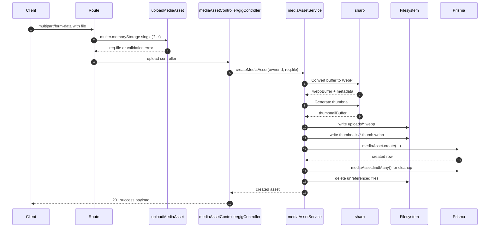
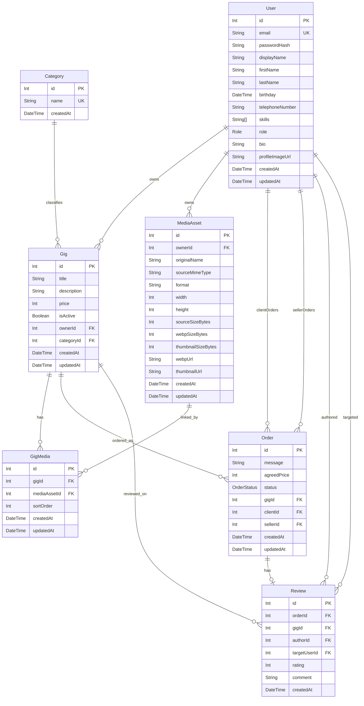
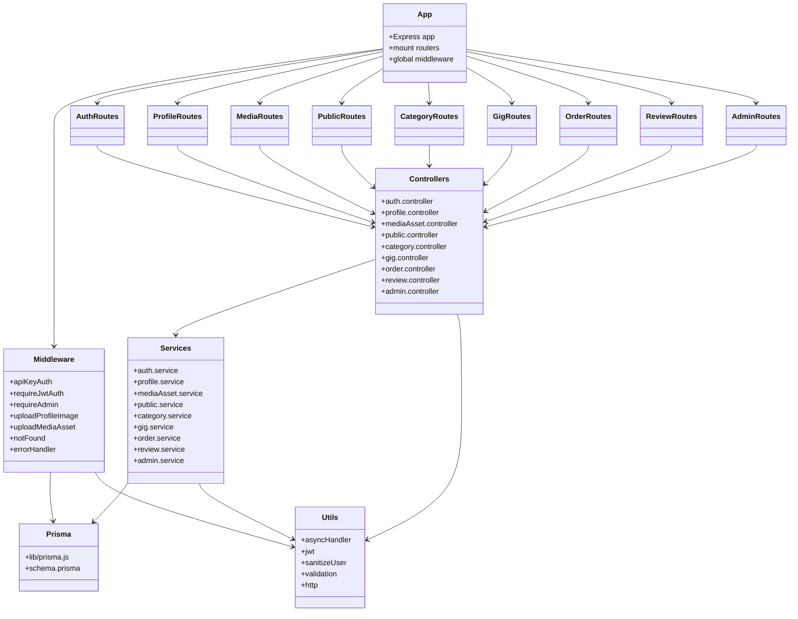

# Fastwork Backend Architecture Audit

## 1. System Overview

This codebase is a Node.js backend built on Express 5 with Prisma/PostgreSQL as the persistence layer. The runtime entrypoint is [`src/server.js`](F:\6.Project\vsCode\nodejs\fastwork-backend\src\server.js), which loads environment variables, registers module aliases, imports the Express app from [`src/app.js`](F:\6.Project\vsCode\nodejs\fastwork-backend\src\app.js), and starts the HTTP listener.

The application serves three broad concerns:

- Identity and profile management: registration, login, current-user lookup, profile updates, profile image upload.
- Marketplace domain: categories, gigs, media assets, orders, reviews, and public landing metrics.
- Administrative operations: protected CRUD and reporting endpoints under `/admin`.

The code is organized around `routes -> controllers -> services -> Prisma`. Controllers are thin and mostly responsible for request parsing and validation; service modules hold business rules, authorization checks, filesystem work, and database access.

## 2. Architecture Style & Patterns

### Primary style

- Layered modular monolith.
- Feature-oriented modules per domain (`auth`, `profile`, `gig`, `order`, `review`, `admin`, `public`).
- Express router composition for transport concerns.
- Service layer for domain logic and Prisma access.

### Notable patterns in actual code

- Thin-controller pattern: controllers validate request input and delegate to services.
- Shared error abstraction: `AppError` plus centralized `errorHandler`.
- Async error wrapping: `asyncHandler` converts rejected promises into Express error flow.
- Mixed authorization strategy:
  - Global API key middleware for a subset of route groups.
  - Route-level JWT authentication.
  - Admin RBAC via `requireAdmin`.
- File-processing pipeline:
  - `multer.diskStorage()` for profile images.
  - `multer.memoryStorage()` + `sharp` WebP conversion for media assets.

### Architectural characterization

This is not a pure MVC application. It is closer to a transport/service/data-access layering model:

- Routes define URL structure and middleware composition.
- Controllers normalize HTTP input/output.
- Services implement business logic and Prisma queries.
- Prisma acts as the repository/ORM boundary.

## 3. Tech Stack

| Layer | Technology | Real usage in code |
| --- | --- | --- |
| Runtime | Node.js, CommonJS | `require(...)`, `module.exports` |
| HTTP | Express 5.2 | App bootstrap, routers, middleware chain |
| Configuration | dotenv | Loaded in `src/server.js` |
| Module resolution | module-alias | `@/...` aliases mapped to `src` |
| Database | PostgreSQL | Prisma datasource |
| ORM | Prisma Client | All persistence access in services/middleware |
| Auth | jsonwebtoken, bcrypt | JWT signing/verification, password hashing |
| Uploads | multer | Request file parsing |
| Image processing | sharp | WebP conversion and thumbnails |
| Static media serving | `express.static` | `/media` mount |
| Dev tooling | nodemon | `npm run dev` |

## 4. Application Entry Flow (server.js -> app.js)

### Runtime bootstrap

1. `src/server.js` loads `.env` via `dotenv`.
2. `module-alias/register` enables `@/` imports.
3. `@/app` is imported.
4. `@/config/env` resolves runtime settings such as port, JWT secret, upload size, media directory, and API-key requirements.
5. `app.listen(port)` starts the HTTP server.

### App construction

`src/app.js` performs all Express composition:

1. Instantiates the Express app.
2. Registers CORS with dynamic origin reflection and credentials enabled.
3. Registers `express.json()` for JSON body parsing.
4. Resolves and creates media directories:
   - `media/profiles`
   - `media/uploads`
   - `media/thumbnails`
5. Mounts `/media` as a static file server rooted at `MEDIA_BASE_DIR`.
6. Exposes `/health`.
7. Mounts route groups in a specific order.
8. Inserts `apiKeyAuth` after some public/semi-public routes.
9. Terminates the pipeline with `notFound` and `errorHandler`.

## 5. Request Lifecycle (Detailed)

### Global request path

1. TCP connection reaches the Node.js HTTP server created by Express.
2. Express hands the request to the middleware stack built in `app.js`.
3. Global middleware runs in declaration order:
   - `cors(...)`
   - `express.json()`
   - static `/media` handling if path matches
4. If the request matches `/health`, Express returns early.
5. If the request matches `/auth`, `/profile`, `/media-assets`, or `/public`, those routers execute before `apiKeyAuth`.
6. Any request reaching `/categories`, `/gigs`, `/orders`, `/reviews`, or `/admin` must first pass `apiKeyAuth`.
7. Route-level middleware may then run:
   - `requireJwtAuth`
   - upload middleware wrapper
   - `requireAdmin`
8. Controller validates/parses parameters and body values.
9. Controller calls service module.
10. Service executes business rules and Prisma/file operations.
11. Controller returns success through `sendSuccess(...)` or manual `res.status(...).json(...)`.
12. Any thrown/rejected error moves to `errorHandler`.
13. Unmatched routes fall through to `notFound`.

### Example: authenticated gig media upload

1. Client sends `POST /gigs/:id/media/upload`.
2. Global `cors` and `express.json` run.
3. Request passes `apiKeyAuth` because `/gigs` is mounted after it.
4. Route applies `requireJwtAuth`, which reads `Authorization: Bearer ...` and sets `req.auth.userId`.
5. Inline wrapper invokes `uploadMediaAsset`, a `multer.memoryStorage()` parser expecting single field `file`.
6. Controller validates `req.params.id` and checks `req.file`.
7. `gigService.uploadGigMedia(...)`:
   - fetches the gig
   - verifies owner matches `req.auth.userId`
   - creates a media asset through `mediaAssetService.createMediaAsset(...)`
   - computes next `sortOrder`
   - inserts `GigMedia` join record
8. `mediaAssetService.createMediaAsset(...)`:
   - transforms uploaded buffer to WebP
   - derives metadata
   - creates thumbnail
   - writes files to disk
   - inserts `MediaAsset` row
   - cleans orphan files
9. Success response returns created asset metadata.

## 6. Middleware Pipeline (Order + Responsibility)

### Global middleware order from `src/app.js`

| Order | Middleware | Responsibility |
| --- | --- | --- |
| 1 | `cors(...)` | Reflects request origin, enables credentials, and allows `Content-Type`, `x-api-key`, `Authorization` headers |
| 2 | `express.json()` | Parses JSON request bodies |
| 3 | `express.static(absoluteMediaDir)` on `/media` | Serves uploaded files directly from disk |
| 4 | `/health` handler | Liveness check |
| 5 | `/auth` router | Authentication routes, no API-key gate |
| 6 | `/profile` router | JWT-protected user profile routes, but not API-key gated |
| 7 | `/media-assets` router | JWT-protected media asset routes, but not API-key gated |
| 8 | `/public` router | Public landing summary route |
| 9 | `apiKeyAuth` | Enforces `x-api-key` for all downstream route groups |
| 10 | `/categories` router | Category endpoints behind API key |
| 11 | `/gigs` router | Gig endpoints behind API key; some additionally require JWT |
| 12 | `/orders` router | Order endpoints behind API key |
| 13 | `/reviews` router | Review endpoints behind API key |
| 14 | `/admin` router | Admin endpoints behind API key, JWT, and admin role |
| 15 | `notFound` | JSON 404 fallback |
| 16 | `errorHandler` | Central exception/error serialization |

### Route-level middleware

| Middleware | Where used | Responsibility |
| --- | --- | --- |
| `requireJwtAuth` | `auth`, `profile`, `media-assets`, selected `gigs`, all `admin` | Validates Bearer token and sets `req.auth.userId` |
| `requireAdmin` | `admin` via `router.use` | Queries Prisma for caller role and enforces `ADMIN` |
| `uploadProfileImage` | `POST /profile/image` | Parses multipart upload, writes original file to `media/profiles`, validates mime type and size |
| `uploadMediaAsset` | `POST /media-assets/upload`, `POST /gigs/:id/media/upload` | Parses multipart upload in memory, validates mime type and size |

### Middleware pipeline diagram

## 7. Routing Architecture

### Mounted route groups

| Base path | Router | Protection | Notes |
| --- | --- | --- | --- |
| `/auth` | `auth.routes.js` | JWT only on `/logout` and `/me` | Registration/login are open |
| `/profile` | `profile.routes.js` | JWT | Not behind `apiKeyAuth` |
| `/media-assets` | `media.routes.js` | JWT | Not behind `apiKeyAuth` |
| `/public` | `public.routes.js` | Public | Landing summary only |
| `/categories` | `category.routes.js` | API key only | `POST /` has no JWT/admin check |
| `/gigs` | `gig.routes.js` | API key globally; JWT on mutating routes | Reads are API-key protected but anonymous |
| `/orders` | `order.routes.js` | API key only | No JWT enforcement |
| `/reviews` | `review.routes.js` | API key only | No JWT enforcement |
| `/admin` | `admin.routes.js` | API key + JWT + admin | Full admin area |

### Architectural implication

The route tree is split by transport-level visibility rather than by domain alone:

- Pre-API-key zone:
  - `/auth`
  - `/profile`
  - `/media-assets`
  - `/public`
- Post-API-key zone:
  - `/categories`
  - `/gigs`
  - `/orders`
  - `/reviews`
  - `/admin`

This means the same backend exposes both first-party user APIs and internal/partner-style APIs, but the boundary is defined only by mount order in `app.js`.

## 8. Authentication & Authorization Flow

### JWT authentication

- `signAuthToken(userId)` signs `{ sub: userId }` using `JWT_SECRET` and `JWT_EXPIRES_IN`.
- `requireJwtAuth`:
  - parses `Authorization` header
  - requires `Bearer <token>`
  - verifies token with `verifyAuthToken`
  - casts `decoded.sub` to integer
  - stores `{ userId }` on `req.auth`

### API key authentication

- `apiKeyAuth` enforces `x-api-key` against `INTERNAL_API_KEY` when `API_KEY_REQUIRED` is true.
- If `INTERNAL_API_KEY` is missing while requirement is enabled, the app returns HTTP 500 for downstream protected routes.
- Because the middleware is mounted in the middle of `app.js`, only later route groups are API-key protected.

### Role-based access control

- `requireAdmin` assumes `requireJwtAuth` has already populated `req.auth.userId`.
- It queries Prisma for the user role on every admin request.
- Only role `ADMIN` is accepted.

### Authorization logic inside services

- `gig.service.js`
  - `assertGigOwner` restricts update/delete/media mutation to the gig owner.
- `order.service.js`
  - prevents gig owners from ordering their own gigs.
- `review.service.js`
  - prevents gig owners from reviewing their own gigs.
- `admin.service.js`
  - prevents an admin from changing their own role.
  - prevents an admin from deleting their own account.
  - prevents deletion of the last remaining admin.

### Important security gap

Several business endpoints trust body/query identifiers instead of the authenticated principal:

- Orders: `createOrder` accepts `clientId` in the request body and has no JWT requirement.
- Orders: list and detail endpoints have no ownership enforcement.
- Reviews: `createReview` accepts `authorId` and `targetUserId` in the body and has no JWT requirement.
- Categories: create endpoint is API-key protected but not admin-protected.

Those are real code-level behaviors, not hypothetical ones.

## 9. File Upload & Image Processing Pipeline

### Profile image pipeline

Implemented through `uploadProfileImage.js` and `profile.controller.js`.

Flow:

1. `requireJwtAuth` authenticates the caller.
2. Inline middleware invokes `uploadProfileImage`.
3. `multer.diskStorage()` writes the uploaded file directly into `media/profiles`.
4. Allowed mime types:
   - `image/jpeg`
   - `image/png`
   - `image/webp`
   - `image/gif`
5. Size is limited by `MAX_UPLOAD_FILE_SIZE_MB`.
6. Controller derives `/media/profiles/<filename>` URL.
7. `profileService.updateProfileImage`:
   - loads existing user
   - resolves old media path from stored URL
   - deletes old file if present
   - updates `User.profileImageUrl`

Characteristics:

- No `sharp` processing.
- Original file format is preserved.
- Filesystem and database update are not transactional.

### Media asset pipeline

Implemented through `uploadMediaAsset.js`, `mediaAsset.controller.js`, `gig.controller.js`, and `mediaAsset.service.js`.

Flow:

1. `requireJwtAuth` authenticates the caller.
2. `multer.memoryStorage()` keeps the file in RAM.
3. Allowed mime types:
   - `image/jpeg`
   - `image/png`
   - `image/webp`
   - `image/gif`
   - `image/tiff`
4. `mediaAssetService.saveProcessedFiles(...)`:
   - validates `file.buffer`
   - generates unique ID
   - converts original to WebP with `sharp(...).rotate().webp(...)`
   - reads width/height metadata from the WebP buffer
   - creates a resized thumbnail with configured width
   - writes processed files to:
     - `media/uploads/*.webp`
     - `media/thumbnails/*-thumb.webp`
5. Prisma `mediaAsset.create(...)` stores metadata and URLs.
6. `cleanupOrphanMediaFiles()` scans DB rows and deletes disk files not referenced by any `MediaAsset`.
7. When called from gig upload flow, a `GigMedia` join row is created with incremented `sortOrder`.

### File upload sequence

## 10. Data Layer (Prisma Models + Relationships)

### Persistence model summary

#### `User`

- Core identity and profile entity.
- Roles: `CLIENT`, `FREELANCER`, `ADMIN`.
- Owns:
  - many `Gig`
  - many `MediaAsset`
  - many client-side `Order`
  - many seller-side `Order`
  - many authored `Review`
  - many received `Review`

#### `Category`

- Lookup entity for gig classification.
- One-to-many with `Gig`.

#### `Gig`

- Marketplace offering owned by a user and assigned to a category.
- Has many `Order`, `Review`, and `GigMedia`.

#### `MediaAsset`

- Processed image metadata and URLs.
- Belongs to `User`.
- Linked to gigs via `GigMedia`.

#### `GigMedia`

- Join model between `Gig` and `MediaAsset`.
- Tracks `sortOrder`.
- Unique on `(gigId, mediaAssetId)`.

#### `Order`

- Connects a client, seller, and gig.
- Has enum status.
- One-to-one optional `Review`.

#### `Review`

- References one `Order`, one `Gig`, an author user, and a target user.
- Unique on `orderId`, enforcing one review per order.

### Real relationship notes

- Cascading deletes exist on:
  - `MediaAsset.owner`
  - `Gig.owner`
  - `GigMedia.gig`
  - `GigMedia.mediaAsset`
  - `Order.gig`
  - `Review.order`
  - `Review.gig`
- `Category -> Gig` does not specify cascade in schema, so default Prisma/PostgreSQL behavior applies.
- Query includes frequently hydrate full graphs, especially on gig, order, and review reads.

### ER diagram

## 11. Module & Code Structure (Controllers, Utils, Middleware)

### Directory responsibilities

| Directory | Role |
| --- | --- |
| `src/` | Application code |
| `src/routes/` | Express routers and middleware composition |
| `src/controllers/` | Request validation and response shaping |
| `src/services/` | Business rules, persistence calls, filesystem work |
| `src/middlewares/` | Auth, uploads, and terminal error handlers |
| `src/utils/` | Async wrapper, JWT helpers, user sanitization, validation, HTTP helpers |
| `src/lib/` | Shared Prisma client |
| `prisma/` | Schema and migrations |
| `media/` | Uploaded files on disk |

### Utility roles

- `asyncHandler`: Promise rejection bridge for Express handlers.
- `jwt`: token signing and verification.
- `sanitizeUser`: strips `passwordHash` and presents a stable external user payload.
- `validation`: reusable primitive validators for IDs, enums, strings, arrays, dates, ratings.
- `http`: `AppError` and `sendSuccess`.

### Component view

## 12. Error Handling Strategy

### Implemented error flow

- Most controllers are wrapped in `asyncHandler`, so thrown async errors reach Express error middleware.
- `requireJwtAuth` and some validation helpers create `AppError`.
- Upload middleware wrappers call `next(error)` explicitly.
- `notFound` handles unmatched routes with a JSON 404.
- `errorHandler` centralizes final serialization.

### `errorHandler` behavior

1. `AppError`
   - returns the specified status code and message
   - includes `details` if present
2. Prisma known errors
   - `P2002` -> `409 Duplicate value violates a unique field`
   - `P2025` -> `404 Resource not found`
3. Multer file-size errors
   - `LIMIT_FILE_SIZE` -> `400 Uploaded file is too large`
4. Fallback
   - logs the raw error with `console.error`
   - returns `500 Internal server error`

### Strengths

- Consistent JSON success/error envelope.
- Useful mapping for common Prisma and upload failure modes.
- No controller duplication of try/catch blocks.

### Weaknesses

- No structured logging or request correlation.
- No normalization for malformed JSON parser errors.
- Some controllers bypass `sendSuccess` and manually shape responses.
- Filesystem operations are often synchronous and can throw between DB and disk changes.

## 13. Security Considerations

### Implemented protections

- Passwords are hashed with bcrypt cost factor `10`.
- JWT tokens are signed and verified with configurable secret and TTL.
- Sensitive user field `passwordHash` is removed by `sanitizeUser`.
- Request validation exists for:
  - IDs
  - enums
  - required strings
  - ratings
  - positive integers
  - string arrays
  - dates
- Uploads validate mime type and file size.
- Admin routes enforce both authentication and role lookup.

### Real security concerns found in code

1. CORS is effectively open reflection.
   - Any supplied origin is accepted and echoed back.
   - `credentials: true` is enabled.
   - There is no allowlist.

2. Several state-changing endpoints are not JWT protected.
   - `/categories` `POST`
   - all `/orders`
   - all `/reviews`

3. Some authorization depends on user-supplied IDs in the body.
   - `order.controller.createOrder` trusts `clientId`.
   - `review.controller.createReview` trusts `authorId` and `targetUserId`.

4. JWT secret has an insecure default.
   - If `JWT_SECRET` is absent, code falls back to `"change-this-jwt-secret"`.

5. Profile/media routes bypass API-key enforcement due to mount order.
   - This may be intentional, but the security perimeter is implicit rather than declarative.

6. Static file serving exposes uploaded media directly from disk.
   - There is no signed URL or access control layer.

7. No rate limiting, brute-force protection, or account lockout.

8. No CSRF mitigation.
   - Likely acceptable for Bearer-token APIs, but CORS + credentials should still be reviewed carefully.

## 14. Scalability & Performance Considerations

### Current strengths

- Prisma query composition is straightforward and maintainable.
- Pagination exists for gig listing.
- Public landing summary uses `Promise.all(...)`.
- Prisma singleton reuse avoids duplicate client creation in development.

### Current scaling constraints

1. Local-disk media storage
   - Ties uploaded files to a single instance.
   - Makes horizontal scaling and stateless deployment harder.

2. Synchronous filesystem calls
   - `writeFileSync`, `unlinkSync`, `readdirSync`, `existsSync` block the event loop.
   - This is especially visible in upload and cleanup paths.

3. Orphan cleanup strategy
   - `cleanupOrphanMediaFiles()` reads all `MediaAsset` rows and scans directories after every create/delete.
   - This becomes expensive as asset count grows.

4. Broad eager loading
   - Many reads include full related objects even when a thinner projection might suffice.

5. No caching
   - Category lists and public landing summary are repeatedly recomputed.

6. No graceful shutdown lifecycle
   - `server.js` does not drain connections or disconnect Prisma on termination.

7. No observability instrumentation
   - Missing metrics, tracing, structured logs, and latency/error dashboards.

### Practical scaling direction

- Move media to object storage and store only references in Prisma.
- Replace sync FS calls with async equivalents or offload processing to workers.
- Turn orphan cleanup into scheduled/background work.
- Add pagination consistently to orders, reviews, admin lists, and user lists.
- Introduce caching for public aggregates and category lookups.

## 15. Observations & Potential Improvements

### High-priority observations

1. Authorization boundaries are inconsistent.
   - `/profile` and `/media-assets` require JWT but not API key.
   - `/orders` and `/reviews` require API key but not JWT.
   - `/categories` create is not admin-protected.
   - Improvement: define security policy per route group explicitly and enforce it declaratively.

2. Identity should come from `req.auth`, not from request bodies.
   - Orders and reviews currently accept actor IDs from the client.
   - Improvement: require JWT and derive `clientId`/`authorId` from `req.auth.userId`.

3. The upload pipeline is correct functionally but not operationally robust.
   - Filesystem and DB writes are not atomic.
   - Cleanup is O(total assets + total files) after each mutation.
   - Improvement: move to object storage + queued post-processing + background reconciliation.

4. The current CORS policy is too permissive for production.
   - Improvement: replace origin reflection with an allowlist from configuration.

5. The app lacks production cross-cutting controls.
   - No rate limiting, audit logging, request IDs, metrics, trace context, or graceful shutdown.
   - Improvement: add these before public production exposure.

### Medium-priority improvements

1. Normalize route protection.
   - Consider applying `apiKeyAuth` or JWT at router-construction level rather than relying on mount order.

2. Separate transport DTOs from Prisma entities.
   - Current responses often expose full included Prisma records directly.

3. Add service-level transactions where multi-step integrity matters.
   - Gig deletion and media deletion span DB and disk work.

4. Add domain-state validation.
   - Orders have status transitions but no transition rules.
   - Reviews do not verify the author is the order's client or that the target matches the seller.

5. Add response pagination and filtering consistency.
   - Only gig listing currently paginates.

6. Replace repeated inline upload wrappers with reusable Express middleware adapters.

### Low-priority improvements

1. Consolidate shared include/query builders across admin and non-admin services.
2. Standardize response formatting so all success paths use `sendSuccess`.
3. Consider extracting media and auth into dedicated modules/services if the domain grows.

## Appendix: Inferred Behaviors

- The system appears intended for a first-party frontend plus internal API consumers because it combines JWT user auth with an application API key gate.
- This is inferred from route placement and middleware usage; the code does not explicitly document the security model.
